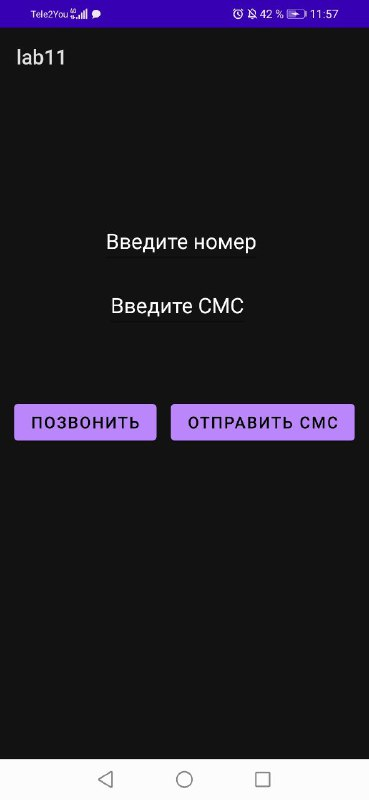

# lab11_12
Лабораторная работа № 11

Тема: Использование функций телефонии в мобильном приложении.
Цель: Научиться работать с функциями вызова абонента и отправки
СМС-сообщений.
Задание: Разработать мобильное приложение с возможностью
осуществлять звонок по номеру телефона и отправки СМС-сообщения.
Порядок выполнения:

1. Создали новый проект;
2. Поместили на форму 2 компонента типа TextEdit – один для ввода
телефонного номера, другой для ввода текста СМС-сообщения;
3. Поместили на форму 2 компонента типа Button – один для кнопки
«Позвонить», другой для кнопки «Отправить СМС»;
4. Добавили разрешения на осуществления вызова и отправки СМС в
файле AndroidManifest.xml:
5. Добавили обработчик события по кнопке «Отправить СМС»
6. Внесли изменения в функцию «onCreate»
7. Запустили приложение и проверили его работоспособность


```Kotlin
package com.example.lab11

import androidx.appcompat.app.AppCompatActivity
import android.os.Bundle
import android.view.View
import android.content.Intent
import android.net.Uri
import android.telephony.SmsManager
import android.text.TextUtils
import android.widget.Button
import android.widget.TextView
import android.widget.Toast


class MainActivity : AppCompatActivity() {
    override fun onCreate(savedInstanceState: Bundle?) {
        super.onCreate(savedInstanceState)
        setContentView(R.layout.activity_main)

        val mDialButton = findViewById<Button>(R.id.call_button)
        val mPhoneNoEt = findViewById<TextView>(R.id.edit_text_number)
        val smsEdit = findViewById<TextView>(R.id.sms_send_edit)
        mDialButton.setOnClickListener(View.OnClickListener()
        {
            fun onClick(v: View)
            {
                val phoneNo: String = mPhoneNoEt.text.toString()
                if(!TextUtils.isEmpty(phoneNo))
                {
                    val dial: String = "tel:" + phoneNo
                    startActivity(Intent(Intent.ACTION_CALL, Uri.parse(dial)));
                }
                else {
                    Toast.makeText(this, "Введите номер телефона", Toast.LENGTH_SHORT).show()
                }
            }
        });

    }

    fun onSms(v: View)
    {
        val edit_Number = findViewById<TextView>(R.id.edit_text_number).text.toString()
        val phoneNo: String = edit_Number
        val sms_edit =findViewById<TextView>(R.id.sms_send_edit).text.toString()
        val toSms: String = "smsto:" + edit_Number
        val messageText : String = sms_edit
        val sms = Intent(Intent.ACTION_SENDTO, Uri.parse(toSms))
        sms.putExtra("sms_body", messageText);
        startActivity(sms);
        SmsManager.getDefault().sendTextMessage(phoneNo, null,
            messageText.toString(), null, null);
    }


}

```


